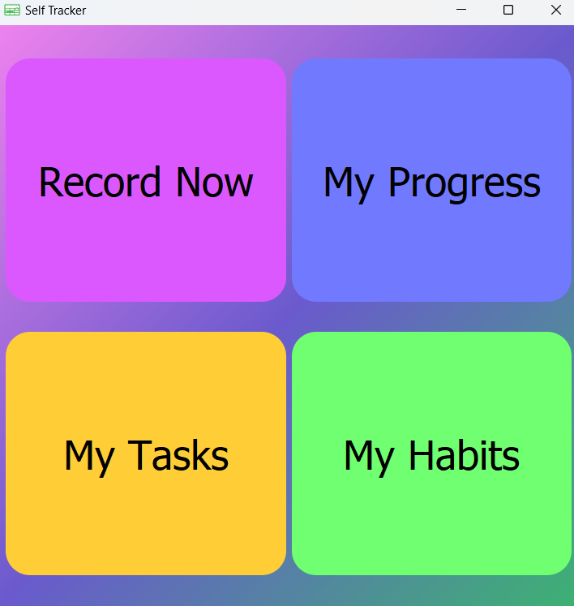
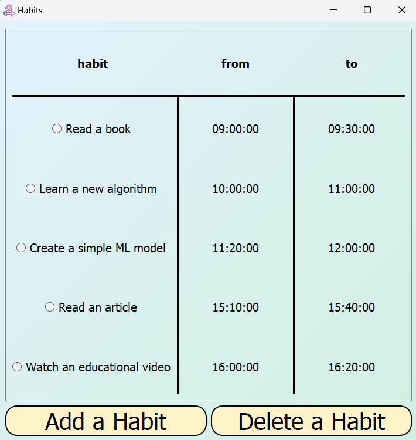
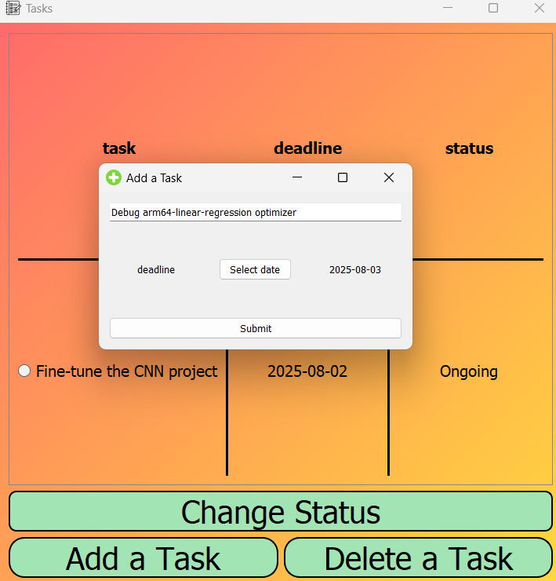
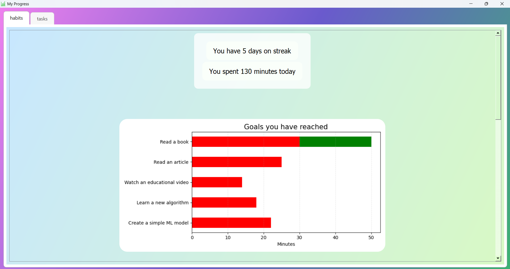
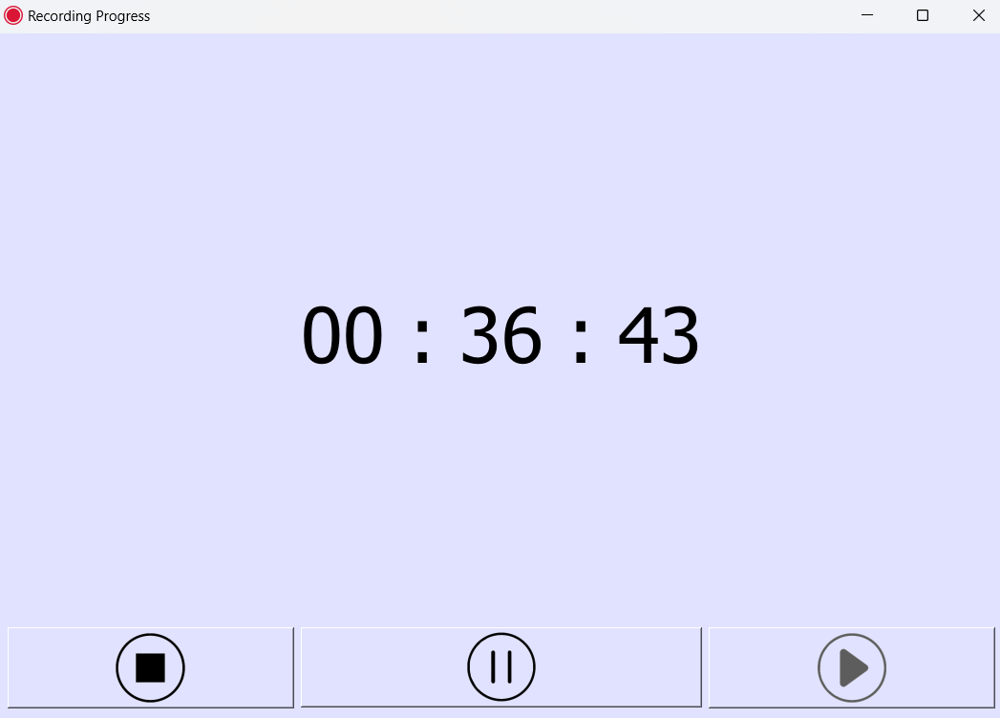

# Self-Tracker

A simple habit and task tracking app built with PyQt5 and PostgreSQL, using Docker for containerization.

## Features

- Track habits with time intervals
- Track tasks with deadlines and completion status
- Record and Save daily progress
- Dockerized setup with PostgreSQL backend

## Screenshots

<div align="center">
  <br><br>
  <br><br>
  <br><br>
  <br><br>
  
</div>

## Getting Started

### Prerequisites

- Docker
- Docker Compose

### Setup

```bash
git clone https://github.com/r4m-t1n/Self-Tracker.git
cd Self-Tracker
python3 run.py
```

## Environment Variables

These variables are configured in the `docker-compose.yml` file under the `app` and `db` services:

| Variable         | Description                  |
|------------------|------------------------------|
| `DB_HOST`        | Hostname of the database     |
| `DB_NAME`        | Name of the PostgreSQL DB    |
| `DB_USER`        | PostgreSQL username          |
| `DB_PASSWORD`    | PostgreSQL password          |


### Alternative (Run without Docker)

The PyQt5 GUI is included in the project, but running it inside Docker proved difficult.
While Docker handles the PostgreSQL well, you can run the GUI outside of the container with:
```
python main.py
```

#### Prerequisites

- Python 3.10+
- PostgreSQL installed and running
- Required Python packages:
```
pip install -r requirements.txt
```